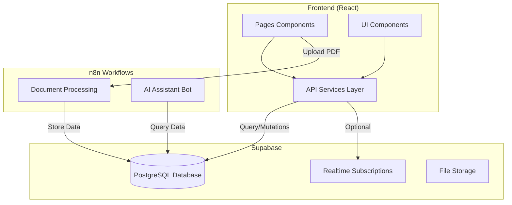

# Full Integration Plan: Frontend to Supabase

## Overview

Replace all mock data usage in the frontend with real Supabase API calls, add a service layer for data operations, implement optional real-time subscriptions, and connect the upload page to n8n workflows.

## Architecture

## Implementation Steps

### 1. Setup Supabase Client and Configuration

**Files to create/modify:**

- `frontend/src/lib/supabase.js` - Supabase client initialization
- `frontend/.env.local` - Environment variables (create if doesn't exist)
- `frontend/.env.example` - Example env file

**Tasks:**

- Install `@supabase/supabase-js` package
- Create Supabase client with environment variables
- Add configuration for optional real-time subscriptions
- Export client for use across the app

### 2. Create API Service Layer

**Files to create:**

- `frontend/src/services/ordersService.js` - Orders CRUD operations
- `frontend/src/services/invoicesService.js` - Invoices CRUD operations
- `frontend/src/services/statsService.js` - Dashboard statistics
- `frontend/src/services/analyticsService.js` - Analytics and reporting
- `frontend/src/services/uploadService.js` - Document upload to n8n
- `frontend/src/services/realtimeService.js` - Real-time subscription management

**Key functions needed:**

- `ordersService.js`: `getOrders()`, `getOrderById()`, `createOrder()`, `updateOrder()`, `deleteOrder()`, `getOrderItems()`, `filterOrders()`
- `invoicesService.js`: `getInvoices()`, `getInvoiceById()`, `createInvoice()`, `updateInvoice()`, `deleteInvoice()`, `getInvoiceItems()`, `filterInvoices()`
- `statsService.js`: `getDashboardStats()`, `getMonthlyTotals()`
- `analyticsService.js`: `getMonthlyData()`, `getSupplierStats()`, `getStatusDistribution()`
- `uploadService.js`: `uploadDocument()`, `checkUploadStatus()`
- `realtimeService.js`: `subscribeToOrders()`, `subscribeToInvoices()`, `unsubscribe()`

### 3. Replace Mock Data in Components

**Files to modify:**

- `frontend/src/pages/Dashboard.jsx` - Replace `mockStats` with API calls
- `frontend/src/pages/Orders.jsx` - Replace mock data, add API calls for CRUD
- `frontend/src/pages/Invoices.jsx` - Replace mock data, add API calls for CRUD
- `frontend/src/pages/Analytics.jsx` - Replace mock data with real analytics
- `frontend/src/pages/Notifications.jsx` - Connect to real alerts/notifications
- `frontend/src/pages/Upload.jsx` - Connect to n8n workflow webhook
- `frontend/src/components/orders/OrdersTable.jsx` - Use API instead of `mockOrders`
- `frontend/src/components/invoices/InvoicesTable.jsx` - Use API instead of `mockInvoices`
- `frontend/src/components/dashboard/StatsCard.jsx` - Use real stats
- `frontend/src/components/dashboard/RecentActivity.jsx` - Use real activity data
- `frontend/src/components/dashboard/AlertsPanel.jsx` - Use real alerts
- `frontend/src/components/analytics/Charts.jsx` - Use real analytics data
- `frontend/src/components/analytics/MonthlyReport.jsx` - Use real monthly data

**Changes needed:**

- Replace direct `mockData` imports with service calls
- Add loading states using React hooks (`useState`, `useEffect`)
- Add error handling with try-catch blocks
- Implement pagination using Supabase's `.range()` method
- Add filtering using Supabase's `.filter()` and `.eq()` methods

### 4. Add Loading and Error States

**Files to create:**

- `frontend/src/components/common/LoadingSpinner.jsx` - Reusable loading component
- `frontend/src/components/common/ErrorMessage.jsx` - Reusable error component

**Files to modify:**

- All pages and components that fetch data to include loading/error states

### 5. Implement Real-time Subscriptions (Optional)

**Files to modify:**

- `frontend/src/pages/Dashboard.jsx` - Add real-time subscription hook
- `frontend/src/pages/Orders.jsx` - Add real-time subscription hook
- `frontend/src/pages/Invoices.jsx` - Add real-time subscription hook

**Implementation:**

- Create custom React hook `useRealtimeSubscription()` in `frontend/src/hooks/useRealtimeSubscription.js`
- Make real-time optional via environment variable or settings
- Subscribe to `orders` and `invoices` table changes
- Update local state when changes occur

### 6. Connect Upload Page to n8n Workflow

**Files to modify:**

- `frontend/src/pages/Upload.jsx` - Replace simulation with real upload

**Implementation:**

- Create upload service that sends PDF to n8n webhook endpoint
- Add file validation (size, type)
- Show real upload progress
- Poll for processing status or use webhook callback
- Display processing results (success/error messages)

### 7. Add Environment Variables

**Files to create/modify:**

- `frontend/.env.local` - Local environment variables (gitignored)
- `frontend/.env.example` - Example file with placeholder values
- `frontend/.gitignore` - Ensure `.env.local` is ignored

**Variables needed:**

- `VITE_SUPABASE_URL` - Supabase project URL
- `VITE_SUPABASE_ANON_KEY` - Supabase anonymous key
- `VITE_N8N_WEBHOOK_URL` - n8n webhook URL for document upload
- `VITE_ENABLE_REALTIME` - Enable/disable real-time (true/false)

### 8. Update Package Dependencies

**File to modify:**

- `frontend/package.json`

**Dependencies to add:**

- `@supabase/supabase-js` - Supabase client library

### 9. Data Transformation Layer

**Files to create:**

- `frontend/src/utils/dataTransformers.js` - Transform Supabase data to match component expectations

**Functions needed:**

- Transform date formats
- Format currency values
- Map database field names to component field names
- Handle null/undefined values

### 10. Error Handling and User Feedback

**Files to create:**

- `frontend/src/utils/errorHandler.js` - Centralized error handling
- `frontend/src/components/common/Toast.jsx` - Toast notification component

**Implementation:**

- Create toast notification system for success/error messages
- Handle Supabase-specific errors (network, auth, validation)
- Provide user-friendly error messages

## Database Schema Assumptions

Based on the mock data structure, the following tables are expected:

- `orders` - id, supplier, order_date, total_amount, net_amount, source_channel, status, created_at
- `order_items` - id, order_id, product_code, description, units, unit_price, batch_number, amount
- `invoices` - id, supplier, invoice_date, total_amount, net_amount, exchange_rate, financing_type, status, created_at
- `invoice_items` - id, invoice_id, item_id, description, units, unit_price, batch_number, amount
- `alerts` or `notifications` - For alerts panel (if exists)

## Integration Points with n8n

1. **Upload Endpoint**: Frontend sends PDF to n8n webhook URL
2. **Processing Status**: Poll n8n webhook or use callback to check status
3. **Data Sync**: n8n workflows write to Supabase, frontend reads via Supabase client

## Testing Considerations

- Test with empty database
- Test with large datasets (pagination)
- Test error scenarios (network failures, invalid data)
- Test real-time subscriptions (enable/disable)
- Test upload functionality with various file sizes

## Migration Strategy

1. Keep mock data as fallback during development
2. Add feature flag to switch between mock and real data
3. Gradually migrate components one by one
4. Test each component after migration
5. Remove mock data once all components are migrated

## Files Summary

**New files to create:**

- `frontend/src/lib/supabase.js`
- `frontend/src/services/ordersService.js`
- `frontend/src/services/invoicesService.js`
- `frontend/src/services/statsService.js`
- `frontend/src/services/analyticsService.js`
- `frontend/src/services/uploadService.js`
- `frontend/src/services/realtimeService.js`
- `frontend/src/hooks/useRealtimeSubscription.js`
- `frontend/src/utils/dataTransformers.js`
- `frontend/src/utils/errorHandler.js`
- `frontend/src/components/common/LoadingSpinner.jsx`
- `frontend/src/components/common/ErrorMessage.jsx`
- `frontend/src/components/common/Toast.jsx`
- `frontend/.env.example`

**Files to modify:**

- `frontend/package.json` - Add Supabase dependency
- All 18 files that currently use mock data (listed in grep results)
- `frontend/src/pages/Upload.jsx` - Connect to n8n
- `frontend/.gitignore` - Ensure env files are ignored